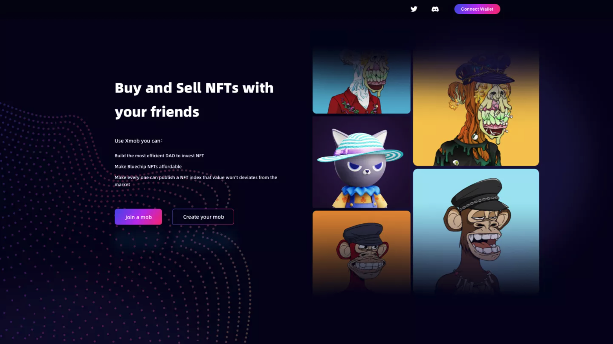

# Buy and Sell NFTs with your friends
It is easy to BUY something with your friends，but sucks in selling it.
X-mob bring a new way to buy and sell nfts smooth.

**you can create a MOB to invest NFT with your friends*:

**you can join a mob to invest NFT*:

**Then you just need to wait the smart contract sell the NFTs you invest.

**No DAO voting.

**No worry about you invest share price with below the opensea price.

# What X-Mob product features bring in?

- Allowing everyone to obtain blue chip NFT shares at low cost through the group purchase design
- Getting rid of the inefficiency of investment DAO’s investing in NFT in terms of selling through the design of front-loaded voting
- Automatic delivery through smart contracts to solve the problem of NFT shares (fragments) easily decoupled from the market
- The design of group purchase + automatic delivery enables the smallest size of NFT index issuance so that any user can issue an NFT index through X-Mob

# What need/problem does X-Mob meet/fix?

- The group purchase lowers the entry barrier for users who need a low-cost way to invest in NFTs because the current average floor price of NFT has reached more than $ 1000 and even higher price for blue chip NFTs.
- NFT derivatives markets that are currently scarce need more tools to hedge the risk of investment, therefore, NFT shares (fragments) that can be - delivered in the real market will engage more arbitrageurs in the market.
- The investment DAOs governed by multi-signature wallets have low efficiency in investing and selling, such DAOs whose members are more than 20 people virtually use the traditional VC's general partner model to tackle the problem.
- X-Mob avoids a circumstance where the assets are locked in the contract because the members disagree with the terms of NFT selling due to the governance introduced to the current fragmentation scheme.

# Deployment
* `npm run deploy` 

# Running tests
* `npm run test`
